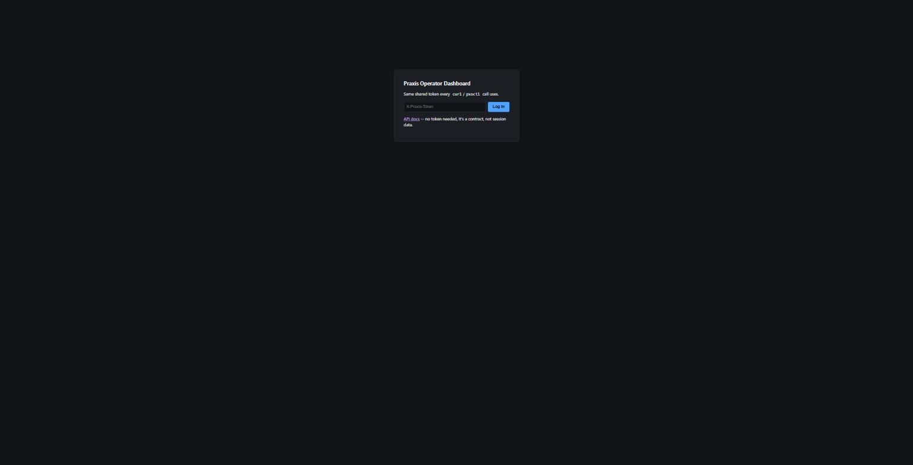
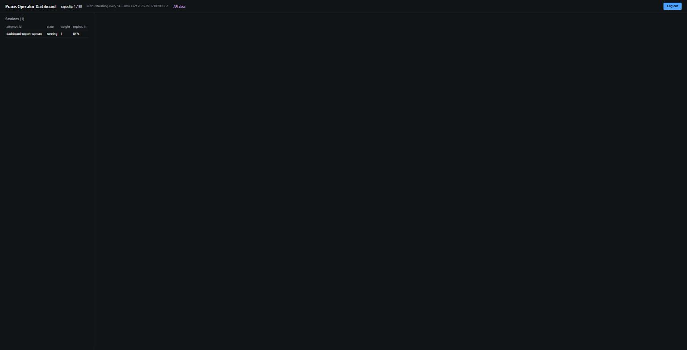
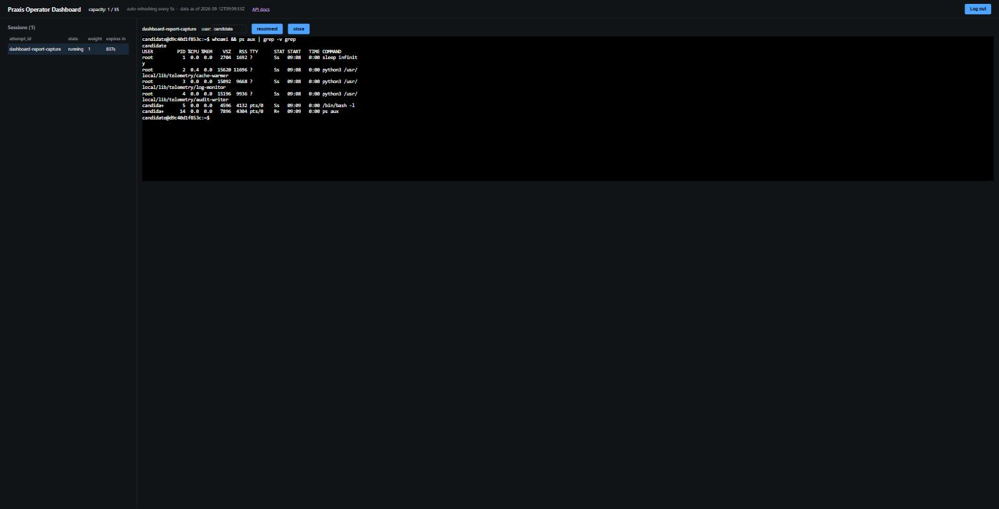
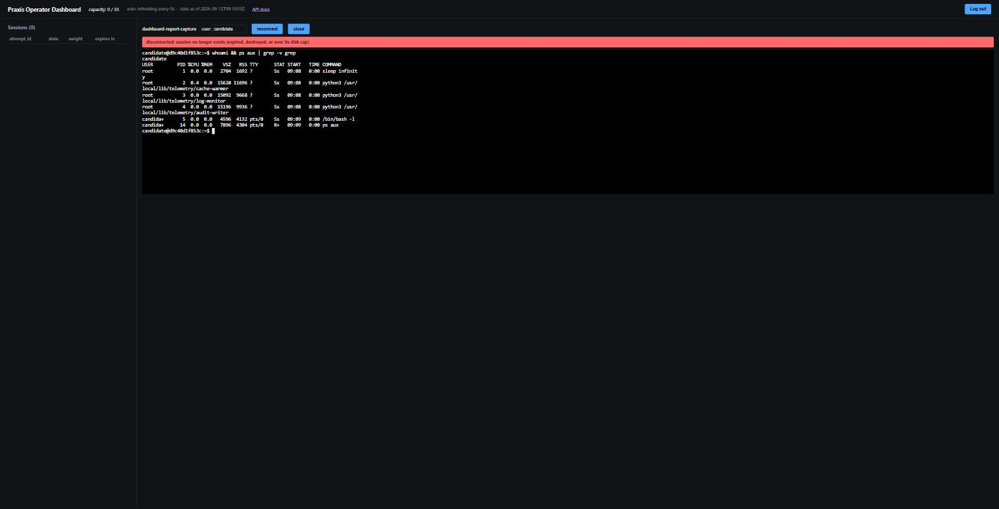

# Operator dashboard — verification report

Real-environment validation record for the `operator-dashboard` feature,
against `docs/dashboard-spec.md`'s acceptance criteria. Two passes: first
against `cmd/mockorchestrator` (during development, no host access), then
against the real production orchestrator through an SSH tunnel — this
document covers the second, since that's the one that actually proves the
feature against real podman-backed sessions rather than an in-memory
stand-in.

## 2026-09-12 — real production run

**Target:** the live `praxis-orchestrator` service, reached via
`ssh -L 8081:127.0.0.1:8081 praxis@<host>` per
`orchestrator/deploy/README.md`'s documented access model. Confirmed
genuinely real, not a stray local mock, two ways before trusting any of
this: no local `mockorchestrator.exe` process running, and
`capacity_limit: 35` matched the real `PRAXIS_CAPACITY_WEIGHT` from Phase
D's actual capacity benchmark — the mock defaults to `1000`.

**Ticket used:** `praxis/sjn-01@sha256:31a20c68...5925bd4`, the real,
already-benchmarked SJN-01 image (`docs/capacity-benchmark.md`).

### 1. Login gates on a real API call

Submitted the real `PRAXIS_ORCH_TOKEN`, verified against `GET /sessions`
exactly as `docs/dashboard-spec.md` acceptance criterion #1 requires — not
a client-side comparison.

### 2. Session list matches live data

`capacity: 1 / 35` and the real `attempt_id` (`dashboard-report-capture`)
appeared within one real reap tick of a `POST /instances` call made
directly against the tunnel — criterion #2 (reflects reality, not a stale
cache) and #3 (capacity legible at a glance).

### 3. Real interactive shell, real container, real planted processes

Clicked the session, typed `whoami && ps aux | grep -v grep` directly into
the xterm.js panel, got real output back through the real
`GET /instances/{id}/shell/ws` endpoint — criterion #4. The output confirms
every process SJN-01's `seed.sh` plants is genuinely running in the real
container:

- `python3 /usr/local/lib/telemetry/cache-warmer` — the Target writer
- `python3 /usr/local/lib/telemetry/log-monitor` — decoy 1
- `python3 /usr/local/lib/telemetry/audit-writer` — decoy 2
- PID 1 `sleep infinity` — `entrypoint.sh`'s own final step after
  backgrounding the three processes above, not a regression of the earlier
  "entrypoint never ran" bug (ROADMAP.md) — that bug meant PIDs 2-4 would
  never have existed at all; here they clearly do.

### 4. Disconnect is visible, not silent

`DELETE /instances/dashboard-report-capture` (confirmed via a subsequent
`404` on `GET /instances/...`), then waited for the dashboard's next poll
to notice the session was gone from `/sessions`. The red "disconnected:
session no longer exists (expired, destroyed, or over its disk cap)" banner
appeared, `capacity` dropped back to `0 / 35`, and the terminal's own
scrollback from step 3 stayed intact rather than being cleared — criterion
#5.

### Result

No bugs found on this pass — every acceptance criterion held against the
real backend exactly as it did against the mock during development. This
closes the last real gap in this feature's verification: everything before
this point (Stages 1-5, the digest-docs clarification) had only ever been
proven against `internal/mockbackend`, never a real container.

Test instance destroyed and confirmed gone before this report was written;
nothing was left running on the host.
